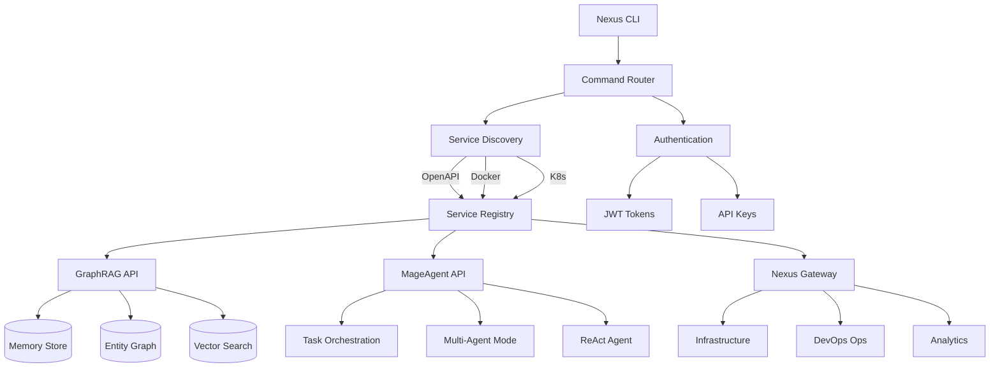

<div align="center">
  

  # Nexus CLI

  **Enterprise-Grade CLI for AI-Powered Development**

  [](https://www.npmjs.com/package/@nexus-cli/cli)
  [](https://opensource.org/licenses/MIT)
  [](https://www.typescriptlang.org/)
  [](https://nodejs.org/)

  **Version:** 3.0.0 | **Last Updated:** December 2024

  [Why Nexus?](#why-nexus-cli) &#8226; [Features](#-features) &#8226; [Quick Start](#-quick-start) &#8226; [Commands](#-command-reference) &#8226; [Architecture](#-architecture) &#8226; [Contributing](#-contributing)

</div>

---

## Why Nexus CLI?

**Most AI CLIs give you a chatbot. Nexus gives you a command center.**

Developers often juggle multiple tools, copy context between terminals, and lose track of what each system knows. Nexus CLI was built to unify your AI-powered workflow into a single, coherent interface.

### Key Capabilities

| Capability | Description |
|------------|-------------|
| **Auto-Discovery** | Automatically detects and integrates 32+ microservices |
| **MCP Integration** | 70+ Model Context Protocol tools exposed as commands |
| **Multi-Agent Orchestration** | Run 10+ concurrent AI agents for complex tasks |
| **ReAct Agent Mode** | Autonomous task execution with up to 20 iterations |
| **Interactive REPL** | Full-featured shell with history and tab completion |
| **Plugin SDK** | Complete extensibility for custom integrations |
| **Workflow Automation** | YAML-based workflows with visual builder |
| **Real-time Monitoring** | Dashboard with alerts and performance metrics |
| **Cost Tracking** | Built-in usage analytics per operation |
| **Session Management** | Save, resume, and checkpoint your work |
| **Collaboration** | Multi-user sessions for team workflows |
| **Streaming** | WebSocket and SSE support for real-time updates |

---

## The Problem We Solve

```
                    ┌─────────────────────────────────────────────────────────┐
                    │            BEFORE: Fragmented Tooling                   │
                    │                                                         │
  ┌──────────┐      │   ┌──────────┐  ┌──────────┐  ┌──────────┐             │
  │ Your     │──────│──▶│ Tool A   │  │ Custom   │  │ Tool B   │             │
  │ Terminal │      │   │          │  │ Scripts  │  │          │             │
  └──────────┘      │   └────┬─────┘  └────┬─────┘  └────┬─────┘             │
                    │        │             │             │                    │
                    │        ▼             ▼             ▼                    │
                    │   ┌──────────────────────────────────────┐             │
                    │   │  Context Lost  │  No Integration    │             │
                    │   │  Manual Sync   │  Limited Features  │             │
                    │   └──────────────────────────────────────┘             │
                    └─────────────────────────────────────────────────────────┘

                    ┌─────────────────────────────────────────────────────────┐
                    │            AFTER: Unified Command Center                │
                    │                                                         │
  ┌──────────┐      │              ┌─────────────────────┐                   │
  │ Your     │──────│─────────────▶│     NEXUS CLI       │                   │
  │ Terminal │      │              │  ┌───────────────┐  │                   │
  └──────────┘      │              │  │ 32+ Services  │  │                   │
                    │              │  │ 70+ MCP Tools │  │                   │
                    │              │  │ 10+ Agents    │  │                   │
                    │              │  │ Full Context  │  │                   │
                    │              │  └───────────────┘  │                   │
                    │              └──────────┬──────────┘                   │
                    │                         │                              │
                    │   ┌──────────┬──────────┼──────────┬──────────┐       │
                    │   ▼          ▼          ▼          ▼          ▼       │
                    │ GraphRAG  MageAgent  Gateway  Analytics  DevOps       │
                    └─────────────────────────────────────────────────────────┘
```

---

## &#10024; Features

### &#128640; Auto-Discovery & Integration

Stop configuring. Start building.

- **Automatic service detection** from Docker Compose, Kubernetes, and OpenAPI specs
- **70+ MCP tools** exposed through Model Context Protocol integration
- **32+ microservices** accessible through a single CLI
- **500+ API endpoints** auto-generated as commands
- **Plugin auto-loading** from `~/.nexus/plugins/`

```bash
# Nexus discovers your entire stack automatically
nexus services list
# Output: 32 services discovered, 47 healthy, 0 degraded

nexus mcp tools
# Output: 70 tools available across 12 providers
```

### &#129302; Intelligent Automation

Your AI that actually gets things done.

- **Natural language commands**: Just describe what you want
- **ReAct agent mode**: 20 autonomous iterations with reasoning
- **Multi-agent orchestration**: Up to 10 concurrent specialized agents
- **Context-aware execution**: Remembers your stack, preferences, and patterns
- **Workflow templates**: YAML-defined automation pipelines

```bash
# Natural language - Nexus understands intent
nexus ask "Deploy the latest GraphRAG changes to staging"

# ReAct agent - autonomous problem solving
nexus agent task "Analyze the codebase and suggest performance improvements" --iterations 20

# Multi-agent - parallel specialized work
nexus agent orchestrate --agents "code-review,security-scan,test-coverage"
```

### &#128268; Extensible Architecture

Build on top of Nexus, don't work around it.

- **Plugin SDK** with full TypeScript support
- **Hot-reloadable** plugins without restart
- **Permission-based sandbox** for security
- **Custom commands** via workspace configuration
- **MCP protocol** support for tool integration

```typescript
// Create a plugin in minutes
import { NexusPlugin, command } from '@nexus-cli/sdk';

export default class MyPlugin extends NexusPlugin {
  @command('greet', 'Say hello')
  async greet(name: string) {
    return `Hello, ${name}! Welcome to Nexus.`;
  }
}
```

### &#127912; Rich Developer Experience

Built by developers, for developers who demand excellence.

- **Interactive REPL** with full history and tab completion
- **Session checkpointing**: Save work, switch contexts, resume later
- **Multiple output formats**: JSON, YAML, Table, Streaming
- **Git integration**: Status, diff, commit from Nexus
- **Real-time streaming**: Watch operations as they happen

```bash
# Interactive mode - your AI command center
nexus repl

nexus> services health --all
nexus> agent start research --topic "GraphRAG optimization"
nexus> session save "morning-work"
nexus> exit

# Resume exactly where you left off
nexus session load "morning-work"
```

### &#128202; Monitoring & Analytics

Know everything. Miss nothing.

- **Service health dashboard** with live updates
- **Custom alert conditions** with webhooks and notifications
- **Performance metrics** per operation
- **Cost tracking** for API operations
- **Time-series analytics** for optimization

```bash
# Real-time health monitoring
nexus monitor --dashboard

# Cost analysis
nexus analytics costs --period 30d
# Output: Total: $47.82 | GraphRAG: $23.41 | MageAgent: $18.90 | Other: $5.51

# Performance insights
nexus analytics performance --service graphrag
```

### &#129309; Collaboration Features

Your team, synchronized.

- **Real-time session sharing**: Pair program with AI assistance
- **Shared workspaces**: Team-wide configurations
- **Role-based access**: Control who can do what
- **Audit logging**: Track all operations

---

## &#128187; Quick Start

### Installation

```bash
# npm (recommended)
npm install -g @nexus-cli/cli

# yarn
yarn global add @nexus-cli/cli

# pnpm
pnpm add -g @nexus-cli/cli
```

### First Run

```bash
# 1. Configure your API endpoint
nexus config set services.apiUrl https://your-nexus-api.com

# 2. Authenticate
nexus auth login
# Opens browser for OAuth, or use API key:
nexus auth login --api-key YOUR_API_KEY

# 3. Verify connection
nexus services health

# 4. Explore what's available
nexus --help
nexus services list
nexus mcp tools
```

### Your First Commands

```bash
# Ask a natural language question
nexus ask "What services are currently running?"

# Check all service health
nexus services health --all

# Start an interactive session
nexus repl

# Run an autonomous agent task
nexus agent task "Analyze authentication patterns in the codebase"
```

---

## &#128218; Command Reference

### Core Commands

| Command | Description |
|---------|-------------|
| `nexus auth login` | Authenticate with Nexus API |
| `nexus auth logout` | Clear stored credentials |
| `nexus auth whoami` | Show current user info |
| `nexus config set <key> <value>` | Update configuration |
| `nexus config get <key>` | Get configuration value |

### Service Commands

| Command | Description |
|---------|-------------|
| `nexus services list` | List all discovered services |
| `nexus services health [--all]` | Check service health |
| `nexus services info <service>` | Get detailed service info |
| `nexus services logs <service>` | Stream service logs |
| `nexus services restart <service>` | Restart a service |

### Agent Commands

| Command | Description |
|---------|-------------|
| `nexus agent task <description>` | Run autonomous agent task |
| `nexus agent orchestrate` | Multi-agent orchestration |
| `nexus agent status <id>` | Check agent task status |
| `nexus agent list` | List running agents |
| `nexus agent stop <id>` | Stop running agent |

### MCP Commands

| Command | Description |
|---------|-------------|
| `nexus mcp tools` | List available MCP tools |
| `nexus mcp run <tool> [args]` | Execute an MCP tool |
| `nexus mcp servers` | List MCP servers |
| `nexus mcp status` | MCP connection status |

### Session Commands

| Command | Description |
|---------|-------------|
| `nexus session save <name>` | Save current session |
| `nexus session load <name>` | Load saved session |
| `nexus session list` | List all saved sessions |
| `nexus session export` | Export session to file |

### Workflow Commands

| Command | Description |
|---------|-------------|
| `nexus workflow run <file>` | Execute workflow from YAML |
| `nexus workflow create` | Interactive workflow builder |
| `nexus workflow list` | List saved workflows |
| `nexus workflow status <id>` | Check workflow status |

### Analytics Commands

| Command | Description |
|---------|-------------|
| `nexus analytics costs` | View cost breakdown |
| `nexus analytics usage` | View usage statistics |
| `nexus analytics performance` | Performance metrics |

---

## &#127959; Architecture

```
┌─────────────────────────────────────────────────────────────────────────────┐
│                              NEXUS CLI                                       │
├─────────────────────────────────────────────────────────────────────────────┤
│                                                                             │
│   ┌─────────────────┐  ┌─────────────────┐  ┌─────────────────────────┐    │
│   │    Commands     │  │      REPL       │  │     Plugin System       │    │
│   │   (60+ cmds)    │  │  (Interactive)  │  │    (SDK + Hooks)        │    │
│   └────────┬────────┘  └────────┬────────┘  └───────────┬─────────────┘    │
│            │                    │                       │                   │
│            └────────────────────┼───────────────────────┘                   │
│                                 │                                           │
│                    ┌────────────▼────────────┐                              │
│                    │     Command Router      │                              │
│                    │  (Discovery + Routing)  │                              │
│                    └────────────┬────────────┘                              │
│                                 │                                           │
│            ┌────────────────────┼────────────────────┐                      │
│            │                    │                    │                      │
│     ┌──────▼──────┐     ┌───────▼───────┐    ┌──────▼──────┐               │
│     │ HTTP Client │     │   WebSocket   │    │     MCP     │               │
│     │  (REST API) │     │  (Streaming)  │    │   (Tools)   │               │
│     └──────┬──────┘     └───────┬───────┘    └──────┬──────┘               │
│            │                    │                    │                      │
└────────────┼────────────────────┼────────────────────┼──────────────────────┘
             │                    │                    │
             ▼                    ▼                    ▼
┌─────────────────────────────────────────────────────────────────────────────┐
│                        NEXUS PLATFORM SERVICES                               │
├─────────────────────────────────────────────────────────────────────────────┤
│                                                                             │
│  ┌─────────────┐  ┌─────────────┐  ┌─────────────┐  ┌─────────────────┐    │
│  │  GraphRAG   │  │  MageAgent  │  │   Gateway   │  │   32+ More...   │    │
│  │   Memory    │  │   Agents    │  │   Routing   │  │    Services     │    │
│  └─────────────┘  └─────────────┘  └─────────────┘  └─────────────────┘    │
│                                                                             │
└─────────────────────────────────────────────────────────────────────────────┘
```

### Service Integration Flow



---

## &#9881; Configuration

### Environment Variables

```bash
# Required
NEXUS_API_URL=https://your-nexus-api.com

# Authentication (choose one)
NEXUS_API_KEY=your_api_key_here
NEXUS_JWT_TOKEN=your_jwt_token_here

# Optional
NEXUS_OUTPUT_FORMAT=json          # json, yaml, table, text
NEXUS_STREAMING=true              # Enable real-time streaming
NEXUS_LOG_LEVEL=info              # debug, info, warn, error
NEXUS_CACHE_ENABLED=true          # Enable response caching
NEXUS_CACHE_TTL=300000            # Cache TTL in ms (5 min)
NEXUS_REQUEST_TIMEOUT=30000       # Request timeout in ms
NEXUS_MAX_RETRIES=3               # Max retry attempts
```

### Configuration Files

**Global config**: `~/.nexus/config.toml`
```toml
[services]
api_url = "https://your-nexus-api.com"
timeout = 30000

[auth]
type = "api-key"
api_key = "${NEXUS_API_KEY}"

[output]
format = "json"
color = true
streaming = true

[plugins]
directory = "~/.nexus/plugins"
auto_update = false
```

**Workspace config**: `.nexus.toml`
```toml
[project]
name = "my-project"
default_service = "graphrag"

[commands]
# Custom command aliases
deploy = "workflow run ./deploy.yaml"
test = "agent task 'Run all tests and report coverage'"
```

---

## &#128640; Plugin Development

Create powerful extensions with the Nexus SDK.

### Quick Start

```bash
# Create new plugin
npx @nexus-cli/sdk create my-plugin
cd my-plugin

# Install dependencies
npm install

# Build and link
npm run build
nexus plugin install ./dist
```

### Example Plugin

```typescript
import {
  NexusPlugin,
  command,
  option,
  PluginContext
} from '@nexus-cli/sdk';

export default class AnalyticsPlugin extends NexusPlugin {
  name = 'analytics';
  version = '1.0.0';
  description = 'Custom analytics commands';

  @command('report', 'Generate analytics report')
  @option('--period <days>', 'Report period in days', '30')
  @option('--format <type>', 'Output format', 'table')
  async generateReport(ctx: PluginContext) {
    const { period, format } = ctx.options;

    // Access Nexus services
    const analytics = await ctx.services.get('analytics');
    const data = await analytics.getReport({ days: parseInt(period) });

    // Format and return
    return ctx.format(data, format);
  }
}
```

---

## &#129309; Contributing

We welcome contributions! Nexus CLI is open source and community-driven.

### Getting Started

```bash
# Fork and clone
git clone https://github.com/YOUR_USERNAME/nexus-cli.git
cd nexus-cli

# Install dependencies
npm install

# Build all packages
npm run build

# Run tests
npm test

# Run in development
npm run dev:cli
```

### Development Guidelines

- **TypeScript**: All code must be TypeScript with strict mode
- **Testing**: Add tests for new features
- **Commits**: Use [Conventional Commits](https://www.conventionalcommits.org/)
- **PRs**: Include description, tests, and documentation updates

See [CONTRIBUTING.md](CONTRIBUTING.md) for detailed guidelines.

---

## &#128220; Documentation

- [Full Documentation](https://docs.adverant.ai/nexus-cli)
- [API Reference](https://docs.adverant.ai/nexus-cli/api)
- [Plugin SDK Guide](https://docs.adverant.ai/nexus-cli/plugins)
- [Configuration Guide](https://docs.adverant.ai/nexus-cli/config)

---

## &#128272; Security

Security is a top priority. See [SECURITY.md](SECURITY.md) for:
- Reporting vulnerabilities
- Security best practices
- Credential management

---

## &#128220; License

MIT License - see [LICENSE](LICENSE) for details.

---

## &#127775; Acknowledgments

Built with these amazing open source projects:

- [Commander.js](https://github.com/tj/commander.js/) - CLI framework
- [Inquirer.js](https://github.com/SBoudrias/Inquirer.js/) - Interactive prompts
- [Chalk](https://github.com/chalk/chalk) - Terminal styling
- [Axios](https://github.com/axios/axios) - HTTP client
- [Zod](https://github.com/colinhacks/zod) - Schema validation
- [MCP SDK](https://github.com/anthropics/mcp) - Model Context Protocol

---

<div align="center">

**Built with &#10084; by [Adverant](https://adverant.ai)**

[Website](https://adverant.ai) &#8226; [Documentation](https://docs.adverant.ai) &#8226; [Twitter](https://twitter.com/adverant) &#8226; [Discord](https://discord.gg/adverant)

</div>
